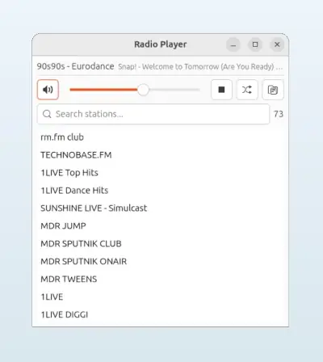

# Radio Player

A simple radio player with a native GTK 4 UI, built in Go. Playback uses libVLC inline via CGO.

<p align="center">
  
  <br>
  
</p>

## Features

- Play internet radio streams from M3U, M3U8, and XSPF playlists
- Show the current stream title when the station provides metadata
- Search/filter stations
- Volume control
- Mute, shuffle, and play/stop controls
- Linux desktop identity for the dock icon

## Requirements

- Go 1.21+
- Build tools (`gcc`, `make`, `pkg-config`)
- GTK 4 development files
- GObject Introspection development files
- VLC and libVLC development files

### Linux (Debian/Ubuntu)

```bash
sudo apt install build-essential pkg-config libgtk-4-dev gobject-introspection libgirepository1.0-dev libvlc-dev vlc
```

## Build

```bash
make build
```

## Usage

```bash
./radioplayer
```

```bash
./radioplayer <playlist-file>
```

## Make Targets

| Target | Description |
|--------|-------------|
| `make build` | Build the binary |
| `make clean` | Remove the binary |
| `make run` | Build and run with default playlist |
| `make install` | Install to `~/.local/bin/` |

## Playlist Files

The player supports standard M3U, M3U8, and XSPF playlist files.
